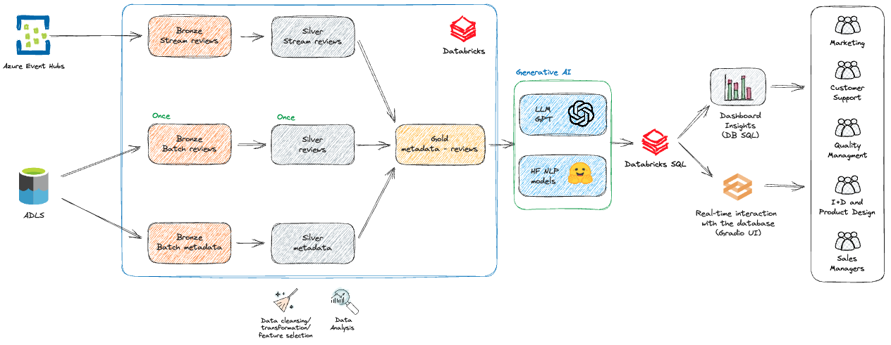

`Factored datathon 2023`_
=========

.. image:: https://github.com/jcabrerahi/factored-datathon-2023-neurum-ai/actions/workflows/ci_pipeline.yml/badge.svg?branch=develop
    :target: https://github.com/pylint-dev/pylint/actions

.. image:: https://img.shields.io/badge/code%20style-black-000000.svg
    :target: https://github.com/ambv/black

.. image:: https://img.shields.io/badge/linting-pylint-yellowgreen
    :target: https://github.com/pylint-dev/pylint

Summary
=======

Find more about this project in the following notion link: `Factored datathon - Neurum AI <https://www.notion.so/Factored-datathon-Neurum-AI-c7ed37b7b8a349eb838ce1d270aca206?pvs=4>`_

Reviews can make or break a business, big or small. And process a big amount of them is a tricky task. Retrieve the insight, also responding to all reviews, thoughtfully and quickly, takes way too long. Through the use of artificial intelligence, we've built **two tools** that can provide useful insights to your e-commerce team and take driven-decision. This will save your time to stay tune with their feedback, know the insight timely and make better decisions. With these powerful tools at your disposal, you can make data-driven decisions and stay ahead of the competition.

We present two products. The first product includes two interactive dashboards that provide a comprehensive overview of your business's performance and customer feedback. The second product is a user-friendly web interface that allows you to effortlessly query the data table using natural language, eliminating the need to request reports from the data team, so you can get the data informations timely.

Product features
----------------

- **Sentiment Analysis**: By processing customer opinions and comments, our cutting-edge technology allows you to pinpoint the overall sentiment towards specific products or your brand as a whole. This powerful insight can guide you in identifying key areas for improvement, enhancing your brand's reputation and customer satisfaction. **[Sales Manager and I+D team]**
- **Product Quality Management**: Our monitoring and analytic capabilities enable you to swiftly identify praise and criticism of your products. You can detect quality issues early on, make the necessary adjustments, and ensure that every product meets the highest standards of excellence. **[Quality Management and Product Design team]**
- **Customer Service Enhancement**: Through the thorough analysis of customer reviews, we provide you with invaluable information about customer expectations and frustrations. Our services empower you to tailor your customer support accordingly, resulting in happier customers and strengthened loyalty. **[Customer support team]**
- **Marketing and Advertising Optimization**: Our solutions offer you a deep understanding of what your customers truly value. Armed with this knowledge, you can design marketing and advertising strategies that are more efficient and targeted, maximizing your ROI and customer engagement. **[Marketing team]**
- **Prevention of Human Errors and Fraud**: Our state-of-the-art monitoring and analysis of customer reviews allow you to detect suspicious or unusual behaviors that may indicate fraud or manipulation in ratings. With insights directly from consumers on our dashboard, you gain a comprehensive overview that helps in taking preventive actions and ensures the integrity of your brand and products. **[Quality Management team]**

Technical Stack
---------------

- Databricks.
- AWS (S3, DynamoDB, EC2).
- Python 3.10.4
- Spark 4.0.0
- SQL.
- Gradio.
- Version control, GitHub.
- CI/CD.
- Terraform.

Architecture
------------

- The first block was developed in the Databricks platform, it contains the multi-hop architecture (Bronze, Silver, Gold). Each data source (reviews and metadata) was processed into a different pipeline as in the above image. In bronze, we ingest the data from batch and streaming sources. In silver, we made the EDA to later apply data cleansing, transformations, feature selection, etc., finally in gold, we JOIN the necessary silver tables to deploy our solution and also, enrich the data with a LLM. Please see the: `Data Engineering <https://www.notion.so/Data-Engineering-be61fd88a0384e7bb10376810749ee62?pvs=21>`_ for more info.
- Second block, we used a LLM to get insight directly from amazon reviews, in this stage we get sentiment, seller actionable, keywords and short response to the customer. In this case we used BERT to historic data, and GPT 3.5 to streaming and coming data. Please see the: `LLM inference <https://www.notion.so/LLM-inference-f51995ae4b8d4a23a9d1b99e3e847943?pvs=21>`_ for more info.
- Third block, we present the data insight in 2 dashboards and UI based in Gradio. It could be helpful to different teams in an e-commerce.

Docs
----

You can find more technical aspects in the following pages, with a focus on the project and Data Engineering, Business Intelligence, and Inference model (LLM).

- `Data Engineering <https://www.notion.so/Data-Engineering-be61fd88a0384e7bb10376810749ee62?pvs=21>`_
- `Dashboards - BI <https://www.notion.so/Dashboards-BI-d3fba742e227453eb29d485cf9eabfba?pvs=21>`_
- `LLM inference <https://www.notion.so/LLM-inference-f51995ae4b8d4a23a9d1b99e3e847943?pvs=21>`_

Next proposals
--------------

- Improvements can be made to utilize other commercial LLM models in the future, such as Llama 2, and to use an LLM within the company to avoid sharing data with third parties.
- DLT can be implemented to directly ingest streams from Azure EventHub, and even the LLM model can be applied at the time of ingestion thanks to DLT.
- Enhancing product listing descriptions. The LLM can be fed with the description so that, based on reviews, the model suggests improvements for a clearer, more descriptive, and persuasive description.
- Conducting an analysis of competitor reviews and the market at large. This analysis could lead to deeper insights into the competitive landscape, helping to further strategize and position your products and services effectively.

Install
-------

.. This is used inside the doc to recover the start of the short text for installation

For command line use, pylint is installed with::

.. code-block:: sh

    pip install poetry

later init the project with poetry, install de dependencies and run the project with::

.. code-block:: sh

    poetry install

.. This is used inside the doc to recover the end of the short text for installation

How to test and pre-commit the code.
-----------------

To test the code, you can run the following command::

.. code-block:: sh

    poetry run pytest --cov-report term-missing --cov=. --local-badge-output-dir badges/

To pre-commit the code, you can run the following command::

.. code-block:: sh

    poetry run pre-commit run --all-files

License
-------

MIT License. See the file LICENSE for details.
